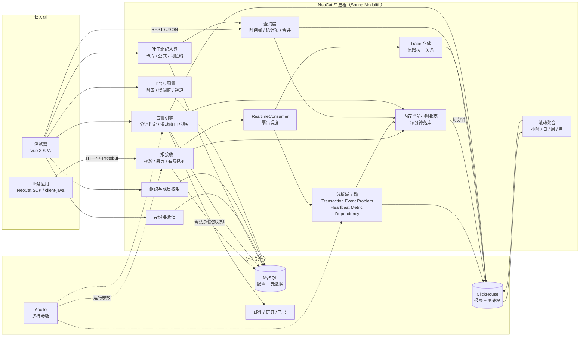
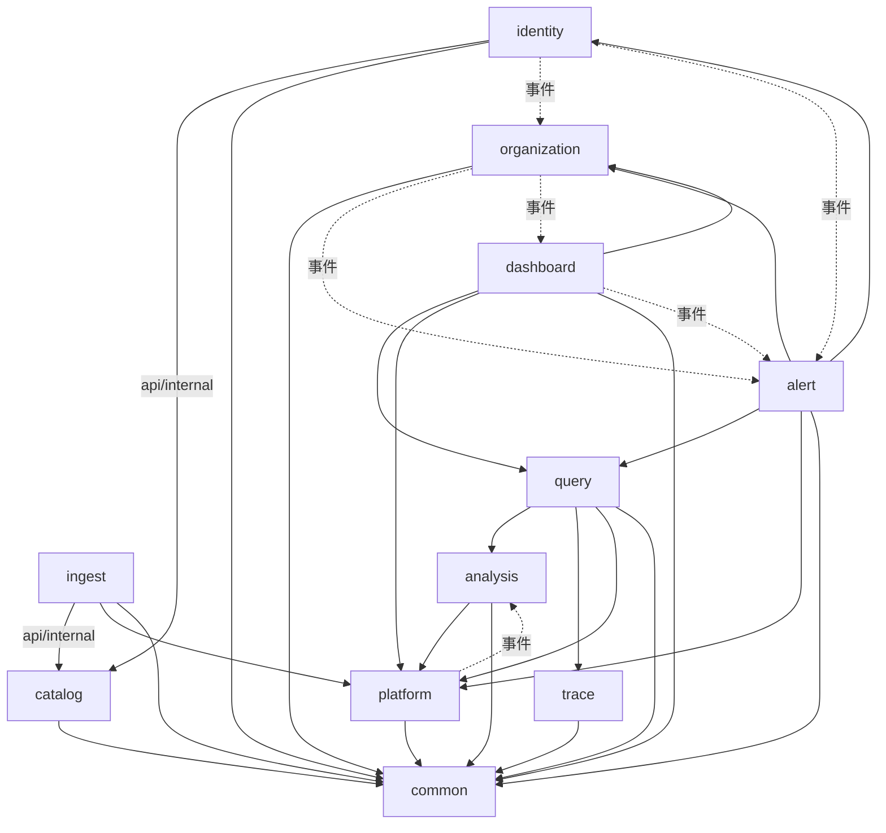
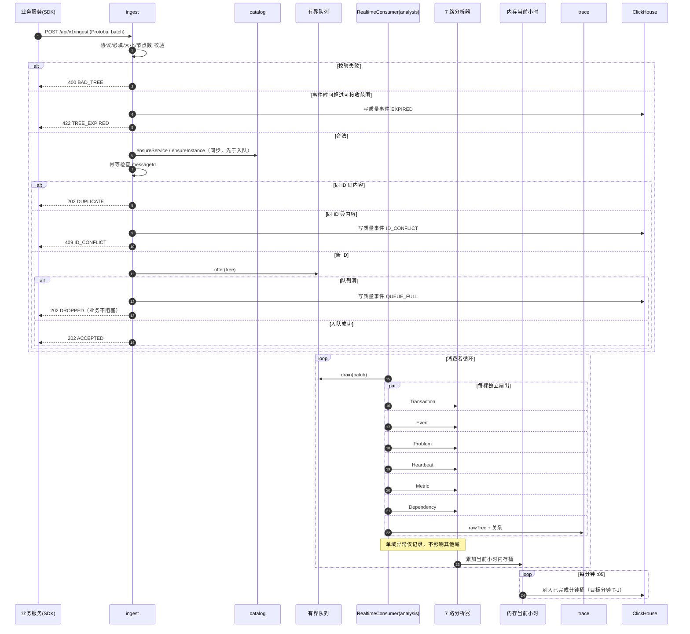
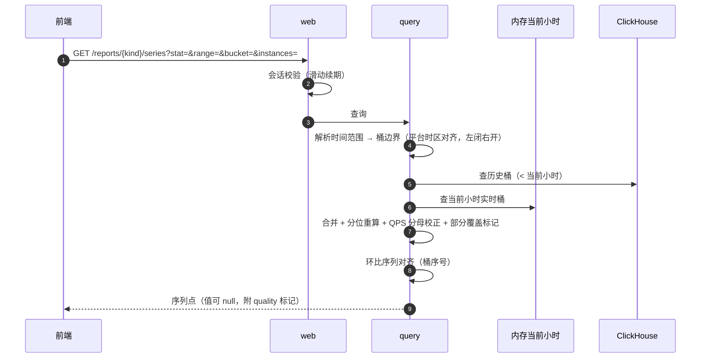
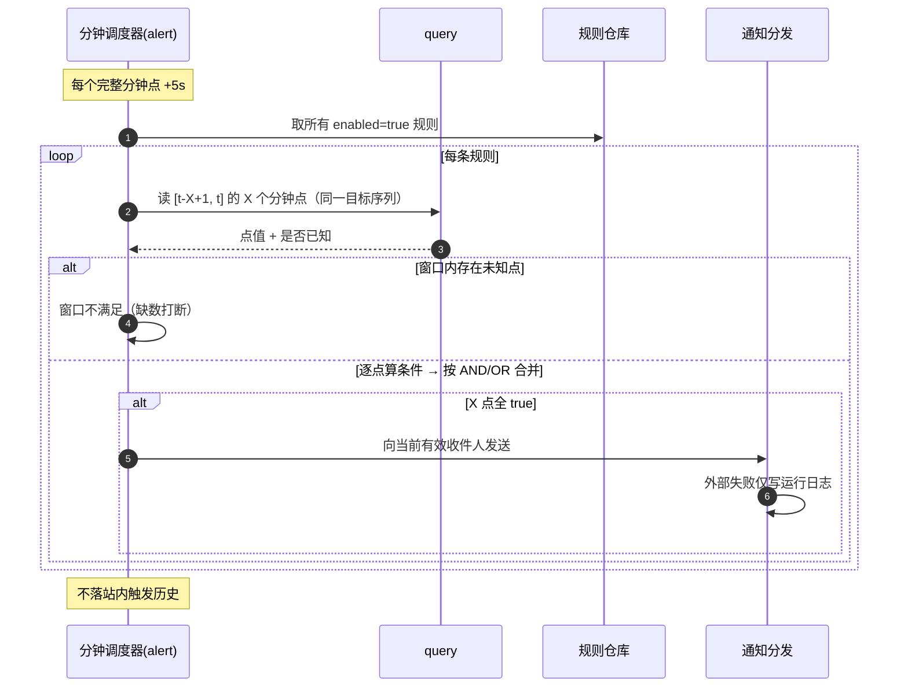
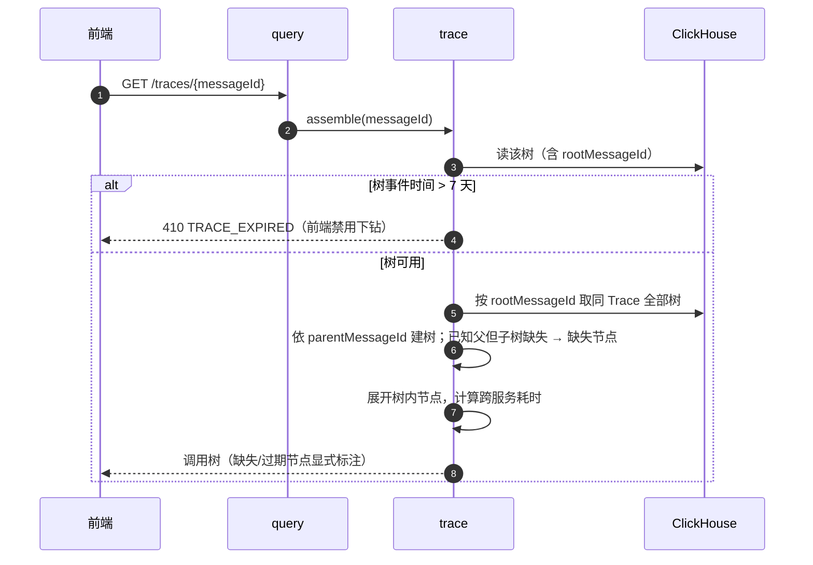
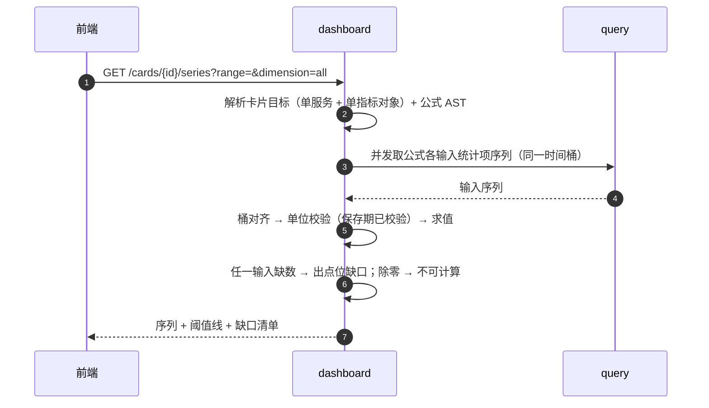
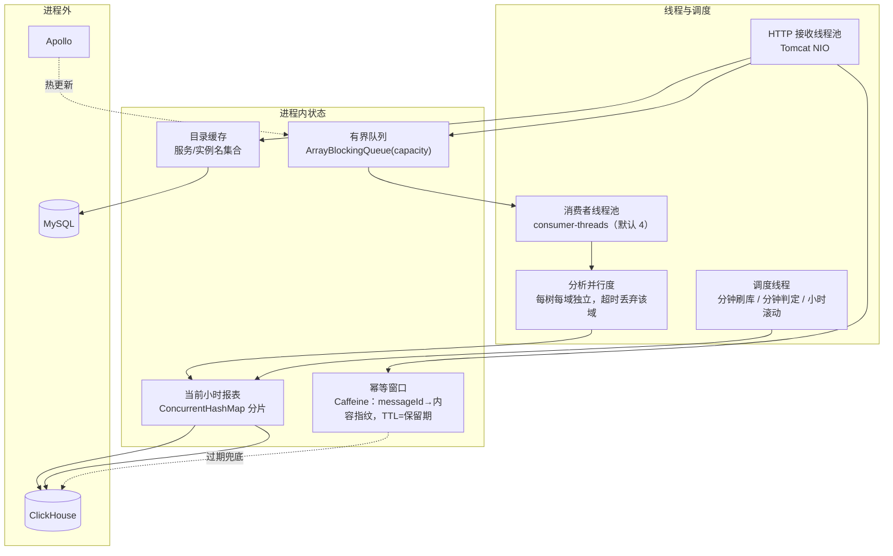

# 01｜技术栈、系统能力与模块架构

## 1. 技术栈

### 1.1 后端

| 层 | 选型 | 版本 | 说明 |
|---|---|---|---|
| 语言 | Java | JDK 17 | 硬约束 |
| 构建 | Maven | 3.9+ | 多模块反应堆：`backend` + `client-java`；上报协议源在仓库根 `proto/`（非模块，见 04 §1.1） |
| 框架 | Spring Boot | 3.3.x | 硬约束 |
| 模块化 | Spring Modulith | 1.2.x | 包即模块，`@ApplicationModule` 声明 allowedDependencies；事件做松耦合 |
| Web | Spring MVC（servlet） | — | 上报接口需快速失败、无响应式必要；`spring-boot-starter-web` |
| 鉴权 | 自研 Session + Cookie（HttpOnly）+ 拦截器 | — | 30 分钟滑动过期、多会话并存、禁用即失效，用 Spring Security 全套过重；仅引入 `spring-security-crypto` 做 BCrypt |
| ORM | MyBatis | 3.5.x | 硬约束；`mybatis-spring-boot-starter`，XML Mapper 显式 SQL |
| 配置中心 | Apollo | 2.x | 硬约束；启动时在线获取运行参数，无本地兜底 |
| 报表库 | ClickHouse | 24.x | 列存，`clickhouse-jdbc` + `HttpClient`；仅查询走 JDBC，写入走批量 append |
| 配置库 | MySQL | 8.0 | 硬约束；InnoDB / utf8mb4 |
| 连接池 | HikariCP | — | Spring Boot 默认 |
| 调度 | Spring `@Scheduled` + 自定义分钟对齐触发器 | — | 分钟判定、分钟落库、小时滚动；单进程无需分布式调度 |
| 测试 | Spock | 2.3-groovy-4.0 | 硬约束：只跑单测，不连真实中间件 |
| 序列化 | Protobuf（上报）、Jackson（REST） | — | `protobuf-java` + 手写 schema |

### 1.2 前端

| 层 | 选型 | 说明 |
|---|---|---|
| 框架 | Vue 3.5 + TypeScript 5.7 | 保留现有工程骨架 |
| 构建 | Vite 6 | — |
| 路由 | vue-router 4 | 收敛为 PRD 能力集 |
| 状态 | Pinia 2 | 仅会话、时间范围、服务上下文 |
| 图表 | ECharts 5 + vue-echarts 7 | 由 `ReportChart` 统一封装 |
| Mock | MSW 2 | Service Worker 层拦截，**唯一** mock 机制 |
| 样式 | 原生 CSS 变量（IBM Carbon 令牌）+ 极简工业风 | 0 圆角、1px 边框、等宽数字、无阴影 |

### 1.3 工程与本地运行

| 项 | 选择 |
|---|---|
| 配置格式 | Apollo 提供运行参数（服务发现、远端读取、缓存回退由 Apollo 客户端负责）；`META-INF/app.properties` 仅声明 `app.id` |
| 本地依赖 | MySQL + ClickHouse + Apollo 均需可用，具体联调见 09 |
| 单测前置 | 无中间件；`mvn -f backend/pom.xml test`（依赖已缓存可加 `-o`） |
| 前端命令 | `npm run dev` / `npm run build` / `npm run flow`（动线脚本自检） |

## 2. 需要支持的技术指标

| 类别 | 指标 | 目标值 | 达成手段 |
|---|---|---|---|
| 接收 | 上报 HTTP 响应 P99 | < 50 ms | 接收路径只做校验+入队；分析全部异步 |
| 接收 | 队列满行为 | 立即返回，不阻塞业务 | 有界 `ArrayBlockingQueue`，`offer` 失败即丢并计数 |
| 接收 | 极限规模 | 几百服务 / 日十亿级调用 | 无状态接收 + 分片键并行消费 |
| 链路 | 接收→可查询 | ≤ 60 s | 内存当前小时聚合，每分钟落 ClickHouse |
| 链路 | 消费者处理延迟 P95 | < 1 s | 批量 drain + 分析器并行扇出 |
| 链路 | 告警判定延迟 | < 30 s | 每个完整分钟点后 5 s 触发判定 |
| 查询 | 单服务小时范围 P95 | < 1 s | 分钟桶预聚合 + 服务/类型前缀主键 |
| 查询 | 大盘首屏 P95 | < 1.5 s | 卡片并发查询 + 卡片级缓存 60 s |
| 存储 | 分钟桶留存 | ≥ 30 天 | TTL `toStartOfDay(minute) + INTERVAL 30 DAY` |
| 存储 | 小时桶留存 | ≥ 30 天 | TTL 同上 |
| 存储 | 日/周/月桶留存 | ≥ 13 个月 | TTL 13 MONTH |
| 存储 | 原始 MessageTree | 7 天 | TTL 7 DAY；> 7 天 Trace 显示过期 |
| 精度 | 分位误差 | 常规流量下 ≤ 5% | 双轨：低基数序列存精确值，高基数存 16 段分布 |
| 可用性 | 单 Analyzer 故障 | 不影响其他域 | 每域独立 try/catch + 质量事件记录 |
| 降级 | 下游变慢 | 只丢监控数据 | 队列有界 + 超时不重试 + 不补算 |

## 3. 系统能力全景



## 4. 模块划分

10 个 Modulith 模块，包路径 `com.neocat.<module>`。

| 模块 | 职责 | 触点 | 对应链路 |
|---|---|---|---|
| `identity` | 账号、口令、角色、会话、首次改密 | 前端 / 其他模块（收件人校验） | 2–6 |
| `organization` | 组织树、成员、有效叶子继承计算、拓扑约束、级联删除 | 前端 / dashboard / alert | 7–10 |
| `platform` | 平台初始化、固定时区、慢阈值、通知通道、留存参数、Apollo 访问 | 全模块 | 1、23 |
| `catalog` | 服务与实例自动发现、按类型+范围过滤的目录查询 | ingest / 前端 | 13 |
| `ingest` | 上报接收、协议校验、幂等、迟到判定、有界队列、丢弃统计 | SDK / analysis | 11、12、14、15 |
| `analysis` | RealtimeConsumer 扇出、7 类分析器、内存当前小时报表、分钟落库、小时/日/周/月滚动、时长与数值分布 | ingest / query / alert | 16、17–22、23 |
| `trace` | 原始 MessageTree 持久化、Trace 关系索引、跨服务组装、缺失与过期表达 | query | 11、22、17 |
| `query` | 统一时间桶、统计项与分位合并、报表读模型、取样、环比 | 前端 / dashboard / alert | 17–23 |
| `dashboard` | 叶子大盘、卡片、目标引用、公式与单位校验、阈值线、维度下钻 | 前端 / alert | 24、25、27 |
| `alert` | 规则模型、预览试算、滑动窗口调度、收件人、通知分发、失效 | 前端 / dashboard / identity / organization | 26–32 |

### 4.1 模块依赖（allowedDependencies）



规则：

1. 模块间**读**走公开接口（`@NamedInterface`），**写/通知**走应用事件。
2. `dashboard → alert` 不存在编译期依赖：卡片目标变化通过 `CardTargetChangedEvent` / `CardDeletedEvent` 通知 alert；alert 反向读取卡片详情经 `dashboard::api` 只读接口，构成 Modulith 允许的「单向调用 + 反向事件」组合，在 `package-info.java` 显式声明。
3. `query` 是唯一的报表读模型出口，dashboard 与 alert 都不得直连 ClickHouse 报表表。
4. HTTP 接口在各业务模块 `api/http`；模块间直接调用经目标模块 `api/internal` 与调用方 `infra` 的防腐适配；统一错误映射位于 `common/http`。部分历史跨域类型仍经旧 `domain` 具名接口公开，尚需迁入 `api/internal`；以可执行模块边界测试检验当前依赖方向。

### 4.2 事件清单

| 事件 | 发布者 | 订阅者 | 载荷 |
|---|---|---|---|
| `PlatformInitializedEvent` | platform | analysis, catalog | timezone, slow thresholds |
| `SlowThresholdChangedEvent` | platform | analysis | url/sql/call/cache ms |
| `UserDisabledEvent` | identity | alert, organization | userId |
| `UserEnabledEvent` | identity | organization | userId |
| `UserPasswordResetEvent` | identity | identity(session) | userId |
| `UserRoleChangedEvent` | identity | — | userId, from, to |
| `OrgMembershipChangedEvent` | organization | alert, dashboard | userId, orgId, granted |
| `OrgDeletedEvent` | organization | alert, dashboard | orgId, cascaded dashboardIds |
| `CardTargetChangedEvent` | dashboard | alert | cardId, dashboardId, orgId, newTarget |
| `CardDeletedEvent` | dashboard | alert | cardId, dashboardId, orgId, removedTargets |
| `TreeIngestedEvent` | ingest | analysis | treeId（仅当入队成功） |
| `TreeDroppedEvent` | ingest | platform(quality) | reason |

## 5. 关键交互时序

### 5.1 上报 → 可查询（链路 11–16、23）



### 5.2 报表查询（链路 17–23）



### 5.3 告警判定（链路 28–32）



### 5.4 Trace 组装（链路 22）



### 5.5 大盘卡片计算（链路 24、25）



## 6. 进程内运行时



要点：

- **幂等窗口**：`messageId → 内容指纹` 放在 Caffeine 内存缓存（TTL 由 Apollo `neocat.ingest.idempotency-window-minutes` 控制，默认 120 分钟）。窗口外的重复 ID 以 ClickHouse `nc_raw_tree` 的存在性做兜底判定（7 天内精确）。
- **当前小时报表**：按 `service` 分片的 `ConcurrentHashMap<SeriesKey, MinuteBucket>`，写路径无锁化（`LongAdder` + 定长分布数组）。
- **分钟刷库**：每分钟 :05 刷入 `T-1` 分钟桶；同分钟重复写入由 ClickHouse 查询期 `sum` 合并（不依赖 `ReplacingMergeTree`）。
- **滚动聚合**：整点后 2 分钟生成小时桶；每日 00:05 生成日桶；周一 00:10 生成周桶；每月 1 日 00:15 生成月桶。启动时按最近缺口回补。
  每次滚动都必须把**分子、极值、耗时分布**一起搬走；漏掉分布会让该层级的
  `tp50…tp9999` 全部变成无值（见 02-modules.md §8.1）。
- **查询期粒度折叠**：内存里只有分钟桶、ClickHouse 分钟表也只有分钟行，
  而调用方可能按 10 分钟 / 1 小时 / 1 天取点。读取侧必须按**请求粒度**把源桶卷到目标桶，
  桶起点锚定目标桶起点；选源表的依据是请求粒度而不是范围长度
  （见 02-modules.md §8.1、03-api-contract.md §4.2）。

## 7. 容量估算与降级

### 7.1 估算（假设）

| 假设 | 值 |
|---|---|
| 服务数 | 300 |
| 日均调用 | 10 亿 |
| 有数据的 (kind, type, name, instance) 组合/服务/分钟 | ~150 |
| 分钟桶行数 | 300 × 150 × 1440 ≈ 6 480 万/天 |
| 分钟桶 30 天 | ≈ 19.4 亿行，压缩后约 40–70 GB |
| 原始树 7 天 | 按 1% 采样留存或全量：全量约 70 GB/天 × 7 |

### 7.2 旋钮（全部经 Apollo 可调，不需重启）

| 旋钮 | 默认 | 作用 |
|---|---|---|
| `neocat.report.minute.retention-days` | 30 | 分钟桶留存，主要存储杠杆 |
| `neocat.trace.sample-rate` | 1.0 | 原始树留存采样率 |
| `neocat.trace.retention-days` | 7 | 与 PRD 一致，调整即改变「过期」边界 |
| `neocat.ingest.queue.capacity` | 65536 | 过载阈值 |
| `neocat.report.exact-values.max` | 200 | 低于该基数存精确值，保证小流量分位准确 |

### 7.3 降级优先级（自低到高）

```text
1. 丢弃新入队消息（不阻塞业务）        ← 第一道，立即生效
2. 提高原始树采样率（Trace 变稀疏）     ← PRD 允许，Trace 属诊断而非告警依据
3. 关闭 Metric 标签明细，仅保留 other   ← 保报表骨架
4. 缩短分钟桶留存                        ← 最后手段，影响小时视图粒度
```

任何一级降级都**不改变**：QPS 口径、缺数≠0、告警窗口语义、留存承诺中的小时/日周月表。

## 8. 与 PRD 的覆盖关系

| PRD 域 | 承载模块 | 覆盖 |
|---|---|---|
| 00 总纲（32 链路、口径） | 全部 | 见 00 文档 §4 映射表 |
| 01 身份组织 | identity, organization, platform | 8/8 验收项 |
| 02 上报 Trace | ingest, catalog, analysis, trace | 7/7 验收项 |
| 03 报表时间桶 | query, analysis | 7/7 验收项 |
| 04 Metric 依赖 | analysis, query | 5/5 验收项 |
| 05 大盘 | dashboard | 7/7 验收项 |
| 06 告警通知 | alert | 10/10 验收项 |
