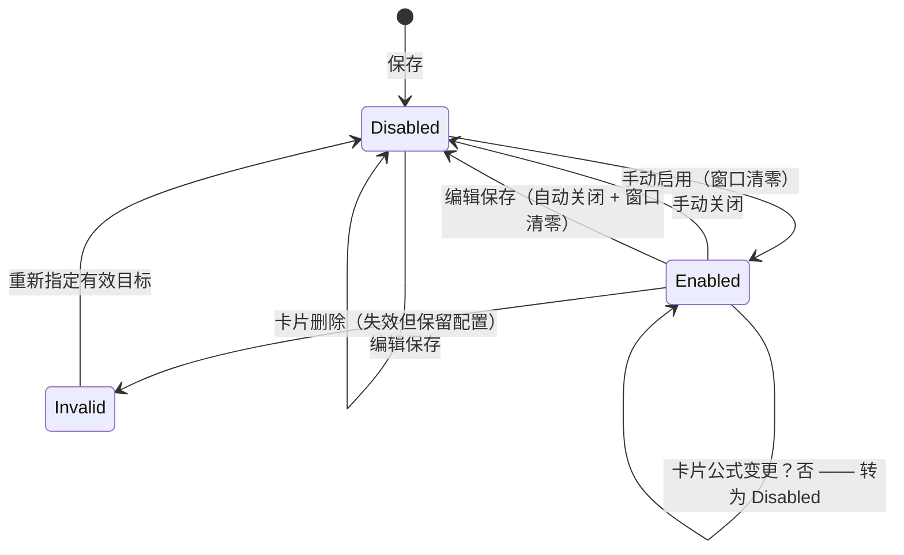

# 02｜模块内部设计

当前包结构：`com.neocat.<module>` 下保留 `api/http`（HTTP 入口）、`api/internal`（模块间方法契约）、`domain`（领域对象、服务与规则）、`infra`（存储、适配器、调度与装配）；不引入空的 `app` 层。各层内按职责细分，例如 `identity/domain/{account,auth,session}`、`analysis/domain/{analyzer,bucket,metric,dependency,schedule}`、`query/domain/{series,stat,report,metric}`、`query/infra/{port,datasource,service}`。小而职责明确的包保持不变；测试包随主要被测职责同步细分。

模块边界仍由 `com.neocat` 直接子包识别，`allowedDependencies` 不变。目标是跨模块仅依赖 `api/internal`，但当前部分领域类型仍通过原具名接口导出，不能声称已经完成接口收紧。Spring Modulith 1.2.10 不合并多个同名包级接口，故新职责子包以**类型级同名 `@NamedInterface`** 聚合原 public 类型及 public 嵌套类型，保留原包声明；`ModuleBoundarySpec` 锁定原接口名与导出集合。完整逐类映射见 [后端分包设计](../superpowers/specs/2026-10-03-backend-package-restructure-design.md)。

---

## 1. identity

### 1.1 领域模型

| 对象 | 关键字段 | 规则 |
|---|---|---|
| `Account` | id, username, passwordHash, role, status, mustChangePassword, createdAt | username 唯一且不可改；role ∈ {USER, ADMIN, SUPER_ADMIN} |
| `Session` | id, accountId, expiresAt, lastSeenAt | 滑动 30 分钟；多会话并存 |
| `PasswordPolicy` | minLength=8 | 新旧密码不可相同 |

### 1.2 用例与规则

| 用例 | 规则 |
|---|---|
| `createAccount` | 调用者 ∈ {ADMIN, SUPER_ADMIN}；创建者只能是 USER；密码 ≥ 8；置 `mustChangePassword=true` |
| `grantAdmin / revokeAdmin` | 仅 SUPER_ADMIN；不允许修改自己；不能经 createAccount 绕过 |
| `resetPassword` | 管理员可重置任意 USER/ADMIN；≥ 8 位；置 `mustChangePassword=true`；**吊销该账号全部会话** |
| `disableAccount` | 吊销全部会话；发 `UserDisabledEvent`；保留组织直接成员关系 |
| `enableAccount` | 发 `UserEnabledEvent`；**不恢复**告警收件关系 |
| `login` | 账号存在且 enabled 且密码匹配；失败统一返回 `BAD_CREDENTIALS`（不暴露账号是否存在）；成功后查最近访问服务 |
| `changePassword`（首登/重置后） | 仅允许此路径；新旧不同；清除标记；进入最近服务 Transaction 或服务列表 |
| `touch(sessionId)` | 每次有效请求续期至 now+30min |
| `logout` | 仅注销当前会话 |

### 1.3 关键算法

**有效会话校验**

```text
isValid(sessionId):
  s = repo.find(sessionId)
  if s == null: return UNAUTHENTICATED
  a = account(s.accountId)
  if a.status != ENABLED: repo.delete(sessionId); return UNAUTHENTICATED
  if s.expiresAt <= now: repo.delete(sessionId); return UNAUTHENTICATED
  if a.mustChangePassword and request not in {changePassword, logout, me}: return PASSWORD_CHANGE_REQUIRED
  repo.touch(sessionId, now+30min); return OK
```

**最近访问服务**：`nc_access_history(accountId, serviceName, accessedAt)`，登录成功进入 `Transaction`；若该服务在当前查询范围内无数据，则进入服务列表。

### 1.4 对外接口

```java
public interface IdentityApi {
    AuthResult authenticate(String username, String rawPassword);
    SessionInfo validate(String sessionId);
    Optional<AccountView> findAccount(long id);
    List<AccountView> findEnabledAccounts(Collection<Long> ids);   // alert 校验收件人
    boolean isEnabled(long userId);
}
```

---

## 2. organization

### 2.1 领域模型

| 对象 | 字段 |
|---|---|
| `OrgNode` | id, name, parentId, leaf（派生） |
| `Membership` | orgId, userId |

### 2.2 用例与规则

| 用例 | 规则 |
|---|---|
| `createNode` | 同父下 name 唯一；**若父节点已是叶子且拥有大盘或组织告警 → 拒绝**（`LEAF_HAS_RESOURCES`） |
| `renameNode` | 同父下唯一 |
| `addMember / removeMember` | 任意节点可加人；变更后**立即重算**受影响用户的有效叶子集合 |
| `deleteNode` | 有子节点 → `HAS_CHILDREN`；叶子删除前返回影响预览；二次确认需提交组织名；确认后原子级联删除大盘/卡片/组织告警 |
| `listEffectiveLeaves(userId)` | 直系 + 祖先继承 |

### 2.3 关键算法

**有效叶子集合（每次成员变更后重算，落 `nc_effective_leaf`）**

```text
effectiveLeaves(userId):
  result = {}
  for node in nodesUserDirectlyIn(userId):
    if isLeaf(node): result += node
    else: result += descendants(node) where isLeaf
  return result          // 同一叶子可能多路径到达，去重
```

**叶子判定**：`isLeaf(n) = 不存在 parentId == n.id 的节点`。

**删除影响预览**：`{orgName, dashboards:[{name, cardCount}], alertRuleCount, memberCount}`。

### 2.4 对外接口

```java
public interface OrganizationApi {
    List<OrgNodeView> tree();
    Optional<OrgNodeView> node(long orgId);
    boolean isLeaf(long orgId);
    boolean isEffectiveMember(long userId, long orgId);
    Set<Long> effectiveLeaves(long userId);
    Set<Long> effectiveMembers(long orgId);      // alert 选收件人
    DeletionPreview previewDeletion(long orgId);
    void deleteCascade(long orgId, String confirmName);
}
```

---

## 3. platform

### 3.1 领域模型

| 对象 | 字段 | 规则 |
|---|---|---|
| `PlatformProfile` | timezone, initialized, slowUrlMs, slowSqlMs, slowCallMs, slowCacheMs | 单行（id=1）；timezone **初始化后只读** |
| `ChannelConfig` | email, dingtalk, feishu（enabled + 凭据） | 未配置的外部通道不可在规则中选择 |
| `RuntimeConfig` | 经 Apollo 读取，带本地默认值 | 队列容量、采样率、留存、超时 |

### 3.2 用例与规则

| 用例 | 规则 |
|---|---|
| `initialize(timezone, adminUsername, adminPassword)` | 仅在未初始化时可执行；一次性建立超管 + 默认慢阈值（1000/100/1000/50）+ 空通道；发 `PlatformInitializedEvent` |
| `updateSlowThresholds(...)` | 只影响后续分析，不回算历史；发 `SlowThresholdChangedEvent` |
| `updateChannels(...)` | 布尔开关 + 凭据；未启用的通道在告警配置中不可选 |
| `timezone()` | 全平台唯一时间基准，所有自然周期/环比/告警分钟点共用 |
| `runtime()` | Apollo 优先，缺失取 `DefaultRuntimeConfig` |

### 3.3 对外接口

```java
public interface PlatformApi {
    PlatformProfileView profile();
    ZoneId zone();
    SlowThresholds slowThresholds();
    ChannelAvailability channels();
    RuntimeConfig runtime();
    boolean initialized();
    void initialize(InitRequest request);
}
```

---

## 4. catalog

### 4.1 领域模型

| 对象 | 字段 | 说明 |
|---|---|---|
| `ServiceEntry` | name（PK）, firstSeenAt, lastSeenAt | 由上报发现，无手工创建 |
| `InstanceEntry` | serviceName, instanceId, firstSeenAt, lastSeenAt | `(serviceName, instanceId)` 唯一 |

### 4.2 用例与规则

| 用例 | 规则 |
|---|---|
| `ensureService(name)` | 幂等 upsert；即使随后入队失败也已发现 |
| `ensureInstance(serviceName, instanceId)` | 同上 |
| `servicesWithData(kind, range)` | **按当前报表类型 + 当前时间范围过滤**，无数据不返回 |
| `instancesWithData(serviceName, kind, range)` | 同上，按实例过滤 |

`servicesWithData` 的判定来源：当前小时读内存报表的序列键集合，历史范围读 ClickHouse 分钟/小时桶 `distinct`。**不返回永久空壳**。

### 4.3 对外接口

```java
public interface CatalogApi {
    void ensureService(String serviceName, Instant at);
    void ensureInstance(String serviceName, String instanceId, Instant at);
    List<ServiceView> services(ReportKind kind, TimeRange range);
    List<InstanceView> instances(String serviceName, ReportKind kind, TimeRange range);
}
```

---

## 5. ingest

### 5.1 领域模型

| 对象 | 字段 |
|---|---|
| `RawTree` | serviceName, instanceId, messageId, rootMessageId, parentMessageId, nodes[], treeTimestamp |
| `IngestResult` | status ∈ {ACCEPTED, DUPLICATE, DROPPED, REJECTED}, code, treeCount |
| `QualityEvent` | type ∈ {EXPIRED, ID_CONFLICT, QUEUE_FULL, MALFORMED, DOMAIN_FAILURE}, messageId, at, detail |

### 5.2 处理流程（严格顺序）

```text
1. 反序列化 Protobuf（失败 → MALFORMED，400）
2. 协议版本检查（未知版本 → 400 UNSUPPORTED_VERSION）
3. 批次规模检查：trees ≤ maxTreesPerBatch，字节 ≤ maxBatchBytes，节点数 ≤ maxNodesPerTree
4. 每棵树字段校验：serviceName/instanceId/messageId 非空且有界长度
5. 事件时间判定：treeTimestamp ∈ [当前自然小时起点 - 2h, now + 1min]
      ≤ 上上小时起点 或 未来 → EXPIRED，整棵拒绝，写质量事件，422
6. 身份发现：catalog.ensureService / ensureInstance（同步，先于入队）
7. 幂等：指纹 = sha256(规范化树内容)
      未见过 → 继续
      见过且指纹相同 → DUPLICATE（不重复目录/统计/Trace）
      见过且指纹不同 → ID_CONFLICT，拒绝，写质量事件，409
8. 入队 offer(tree)
      成功 → ACCEPTED
      队列满 → QUEUE_FULL，丢弃，写质量事件，202 DROPPED
9. 立即返回（不等待分析）
```

**关键顺序不变式**：节点 6 在节点 8 之前 —— 保证「队列满也仍可发现服务/实例」。

### 5.3 幂等实现

```text
idempotency:
  key = messageId
  cached = window.getIfPresent(key)       // Caffeine，TTL = idempotency-window-minutes
  if cached != null: return cached == fingerprint ? DUPLICATE : ID_CONFLICT
  exists = traceStore.existsRawTree(messageId)   // ClickHouse 兜底，7 天内精确
  if exists:
      stored = traceStore.fingerprintOf(messageId)
      return stored == fingerprint ? DUPLICATE : ID_CONFLICT
  window.put(key, fingerprint)
  return NEW
```

### 5.4 过载与隔离

- 队列：`ArrayBlockingQueue<RawTree>(capacity)`，单进程。
- 接收线程**只做 offer，绝不阻塞**；offer 失败立即返回并计数。
- 丢弃**不补算**；`nc_quality_event` 记录 `QUEUE_FULL` 以便前端展示数据质量。
- 接收量/丢弃量/队列水位通过 Micrometer 指标暴露。

### 5.5 对外接口

```java
public interface IngestApi {
    IngestResult accept(IngestBatch batch);       // web 层调用
    QueueStats stats();                            // 管理页/日志
}
```

---

## 6. analysis

### 6.1 领域模型

| 对象 | 说明 |
|---|---|
| `MinuteBucket` | 键 (service, kind, type, name, instance, minute)；值包含 count, failCount, durationSum, durationMin/Max, 分布数组, 数值统计 |
| `SeriesKey` | (service, kind, type, name, instance \| OTHER) |
| `SeriesCatalog` | 服务 → kind → type → name → instances 的层级索引 |
| `Analyzer` | 接口：`analyze(RawTree)`；7 个实现 |
| `TraceRelation` | (messageId, parentMessageId, rootMessageId, serviceName, instanceId) |

### 6.2 RealtimeConsumer

```text
loop:
  batch = queue.poll(batchSize, batchTimeout)
  parallelFor tree in batch:
     for analyzer in analyzers:
        try analyzer.analyze(tree)
        catch e: qualityEvent(DOMAIN_FAILURE, analyzer.name, tree.messageId, e)
  flushSeriesIndex()
```

- 扇出顺序无关，各域独立 try/catch；**单域失败不阻断其他域**，也不重放（该域产生缺口并记录）。
- 消费者线程数 = `consumer-threads`（默认 4，Apollo 热改）。

### 6.3 7 路分析器

| 分析器 | 输入 → 输出 | 关键规则 |
|---|---|---|
| `TransactionAnalyzer` | Transaction 节点 → 分钟桶 + 类型/名称层级 + 分布 | 记录 type、name、instance、status、duration；丢弃 status=0 之外的成功定义见 PRD：非成功状态计入 failures |
| `EventAnalyzer` | Event 节点 → 分钟桶 | 仅次数/失败/QPS；**不产出耗时字段** |
| `ProblemAnalyzer` | Transaction/Event 节点 + 平台慢阈值 → 问题记录 | ① 非成功状态 → `EXCEPTION`（按异常名聚合，完整消息仅入取样/原始树）② type 为 URL/SQL/CALL/CACHE 且 duration > 对应阈值 → `SLOW_URL/SLOW_SQL/SLOW_CALL/SLOW_CACHE`（按 Transaction Name 聚合）③ 同一次调用可同时进异常与慢类 |
| `HeartbeatAnalyzer` | JVM Heartbeat 节点 → 实例级分钟桶 | 堆已用/最大、GC 次数/耗时、线程数；**按实例存，不合并不同 JVM** |
| `MetricAnalyzer` | Metric 节点 → 序列（规范化标签） + 小时内排名 | 见 6.4 |
| `DependencyAnalyzer` | RemoteCall/跨服务节点 → 依赖边 | 记录上游→下游、次数、失败、耗时；被调用方未上报也计入边（方向不依赖下游树） |
| `TraceWriter` | RawTree → 原始树 + 关系索引 | 按采样率落库 |

### 6.4 Metric 标签规范化与 Top1000

```text
normalize(labels):  按键名字典序排列 → 拼成稳定串 → 作为序列身份
onAnalyze(metric):
   seq = normalize(labels)
   if hourRank.get(service, hour).isEmpty():
        hourRank.init(service, hour)              // 新小时从空排名开始
   hourRank.incr(service, hour, seq, 1)
   if seq already promoted: writeBucket(seq, value)
   else if hourRank.count(service, hour) <= 1000: promote(seq); writeBucket(seq, value)
   else: writeBucket(OTHER, value)               // 第 1001 起直接进 other
```

**排名固化**（每小时 :00:30）：以整小时计数排序，取前 1000 为真实序列，其余**合并进 `other`**；固化后该小时内后到（迟到）的数据按固化结果归属：属于前 1000 → 写真实序列；否则 → `other`。

**跨小时查询**：某具体序列在小时 H 未被保留 → 该小时返回**缺口**并标记 `mergedIntoOther`，**不用 other 值冒充**。

### 6.5 内存当前小时报表

```text
structure:  Map<ServiceShard, Map<SeriesKey, MinuteBucket[]>>
shard:      hash(service) % shardCount（默认 16）
write:      bucket = shards[...].computeIfAbsent(key).at(minute)
            bucket.count.increment(); bucket.durationSum.add(d); bucket.observe(d)
read:       只读当前小时的 [小时起点, 当前分钟]
rollover:   整点后 2 分钟：把上一小时定稿刷入 ClickHouse，清空该小时分片
```

### 6.6 分钟落库 / 小时滚动

| 调度 | 时机 | 动作 |
|---|---|---|
| 分钟刷库 | 每分钟 :05 | 把 `now-1 分钟` 的桶刷入 `nc_minute_bucket`（重复刷由查询期 `sum` 合并） |
| 小时聚合 | 整点后 :02 | `nc_minute_bucket` → `nc_hour_bucket`（合并分子、分布后重算分位） |
| 日聚合 | 00:05 | `nc_hour_bucket` → `nc_day_bucket` |
| 周聚合 | 周一 00:10 | 周一起点（平台时区周一 00:00）→ `nc_week_bucket` |
| 月聚合 | 每月 1 日 00:15 | 月起点 → `nc_month_bucket` |
| 留存清理 | 每日 02:00 | 由 ClickHouse TTL 自动执行；应用只上报留存参数 |

**聚合不变式**：任何聚合层级都**不平均子层分位/平均值**；先合并分子（count、failCount、durationSum、数值和）与分布数组，再计算 `avg` / `failureRate` / `tp*`。

### 6.7 分位实现（双轨）

| 基数 | 方式 | 精度 |
|---|---|---|
| 桶内样本 ≤ `exact-values.max`（默认 200） | 存真实值列表，精确分位 | 100% |
| 超过 | 16 段对数分布（每段 1/16 分位估计） | 常规流量 ≤ 5% 误差 |

分布以固定长度数组（16 桶）序列化进 ClickHouse `Array(UInt64)` 列，聚合时逐元素相加。

### 6.8 对外接口

```java
public interface AnalysisApi {
    QueueStats queueStats();
    HourlySnapshot consume(String service, ReportKind kind, Instant hourStart);
    Set<String> servicesWithDataInCurrentHour(ReportKind kind);
    Set<String> instancesWithDataInCurrentHour(String service, ReportKind kind);
}
```

---

## 7. trace

### 7.1 存储模型

| 表 | 内容 |
|---|---|
| `nc_raw_tree` | 原始树（treeTimestamp, service, instance, messageId, rootMessageId, parentMessageId, payload, fingerprint） |
| `nc_trace_relation` | (messageId, rootMessageId, parentMessageId, service, instance, treeTimestamp) |

### 7.2 组装算法

```text
assemble(messageId):
  seed = findTree(messageId)
  if seed == null: return MISSING
  if age(seed.treeTimestamp) > retention(trace): return EXPIRED
  root = seed.rootMessageId
  trees = findTreesByRoot(root)                 // 7 天内
  nodes = map by messageId
  build tree:  parentMessageId → children
  for t in trees:
     if t.parentMessageId != null and t.parentMessageId not in nodes and
        parentWasObserved(t): mark MISSING_NODE(t)
     if t existed but aged out: mark EXPIRED_NODE(t)
  expand each tree's internal nodes into spans
  compute cross-service duration = child.rootSpan.start - parent.remoteCall.start
  return assembled tree
```

**缺失 vs 过期区分**：`MISSING` 表示从未收到（依赖统计仍有效）；`EXPIRED` 表示曾收到但已超留存。

### 7.3 对外接口

```java
public interface TraceApi {
    Optional<TraceView> assemble(String messageId);
    boolean existsRawTree(String messageId);
    Optional<String> fingerprintOf(String messageId);
    List<String> recentSampleMessageIds(SampleQuery query);   // 取样：最近 30 条
}
```

---

## 8. query

### 8.1 时间桶引擎

```text
resolveRange(RangeSpec):
  固定周期: HOUR → [h, h+1h) 粒度 1min
            DAY  → [d, d+1d) 粒度 10min
            WEEK → [周一00:00, 下周一00:00) 粒度 1h
            MONTH→ [月初, 下月初) 粒度 1d
  快捷:     1h→1min  3h→5min  6h→10min  12h→20min  24h→1h  今天→10min  本周→1h
  对齐:     与平台时区固定边界对齐；首尾部分桶保留并标 partial
  bucketStart 为左闭右开区间起点
```

| 统计项 | 桶内算法 |
|---|---|
| Hits | Σ count |
| Failures | Σ failCount |
| QPS | Σ count ÷ 桶实际覆盖秒数 |
| Avg Duration | Σ durationSum ÷ Σ count |
| Failure Rate | Σ failCount ÷ Σ count |
| Min / Max | 真实 min / max |
| tp50…tp9999 | 合并分布（或合并精确值）后重算 |
| 公式类 | 先按桶对齐输入序列，再求值 |

**桶内聚合不变式适用于所有层级**（分钟→小时、小时→日/周/月、源桶→请求粒度）：

```text
聚合时必须一起搬运三个部分：
1. 分子    count / failCount / durationSum / valueSum / valueCount
2. 极值    durationMin / durationMax（取真实极值，不参与求和）
3. 分布    durationDistribution（逐段相加）

漏掉分布 → 该层级的 tp* 全部变成无值，且不会报错。
禁止：平均子桶的 avg / failureRate / 分位。
```

**读取侧按请求粒度聚合**（技术方案 03 §4.1）：

```text
粒度 ≥ 1 天     → 日桶
粒度 = 1 小时   → 小时桶
粒度 ≤ 20 分钟  → 分钟桶，并在读侧折叠到目标粒度

选源表的依据是「请求粒度」而不是「范围长度」：
范围长不代表点要粗，「3 天看每分钟」是合法请求。
若按范围长度推断粒度，这类请求会拿到粒度不符的桶，
调用方按桶起点取数时只能命中少数边界桶，趋势图大面积缺失。
```

> **QPS 分母与折叠**：折叠后的行取目标桶自己的 `coveredSeconds`（未结束的桶截到 now），
> 不是各源桶分母之和 —— 否则同一份次数会被重复计入分母。

**QPS 分母规则**（严格按 PRD）：

```text
if bucket 是当前未结束小时: 分母 = 该小时起点 → now 的实际秒数
else if bucket 是完整历史小时: 分母 = 3600
else: 分母 = 桶实际覆盖秒数
多机器: 先合并 count，再除公共分母（禁止平均各机器 QPS）
```

### 8.2 数据质量标记

| 标记 | 产生条件 | 前端表现 |
|---|---|---|
| `NO_DATA` | 序列在该桶不存在，且无「确认无调用」证据 | `null` 缺口 |
| `ZERO` | 桶完整且 count = 0 | 次数类显示 0；耗时/比例类显示无值 |
| `PARTIAL` | 桶只覆盖部分查询范围 | 标记「部分覆盖」 |
| `REALTIME` | 桶为当前仍在写入的桶 | 标记「实时」+ 每分钟原位更新 |
| `DROPPED` | 该桶存在 `QUEUE_FULL` 质量事件 | 缺口并标明原因 |
| `MERGED_OTHER` | Metric 具体序列该小时并入 other | 缺口并标明「该小时已合入 other」 |
| `TRACE_EXPIRED` | 树超 7 天 | 禁用下钻 |

**判定顺序**：先看质量事件（DROPPED），再看桶存在性，最后看 count=0。

### 8.3 环比

- 支持 `1天前 / 7天前 / 30天前` 同时段；按平台时区整日偏移；**桶序号对齐**（如 `10:20–10:30` 对齐偏移后同一时段桶）。
- Heartbeat 不做环比。
- 月环比**不是**上一个自然月。

### 8.4 取样

```text
sample(query): 按事件时间倒序，取最近 30 条
  约束：当前服务 + 当前时间范围 + 实例 + (Type/Name | Problem) 筛选
  返回：messageId、事件时间、耗时、状态、样例关键字段
  messageId 用于进入 Trace；树超 7 天 → 该条不可下钻
```

### 8.5 对外接口

```java
public interface QueryApi {
    SeriesResult series(SeriesQuery query);                 // 趋势
    ReportTable typeTable(ReportQuery query);               // Type / Name 层
    List<Sample> samples(SampleQuery query);
    SeriesResult withMom(SeriesQuery query, MomKind kind);
    List<DependencyRow> dependencies(String service, Direction dir, TimeRange range);
    MetricSeries metricSeries(MetricQuery query);
    HeartbeatView heartbeat(String service, TimeRange range, int topN);
}
```

---

## 9. dashboard

### 9.1 领域模型

| 对象 | 字段 | 规则 |
|---|---|---|
| `Dashboard` | id, orgId, name, orderNo | orgId 必须是叶子；无个人大盘 |
| `Card` | id, dashboardId, service, targetKind, targetType, targetName, targetMetricLabels, dimensionScope, orderNo | **一张卡片 = 一个服务 + 一个指标对象** |
| `CardFormula` | cardId, ast（聚合与四则运算）、统计项引用列表 | 保存期做单位校验 |
| `ThresholdLine` | cardId, direction(ABOVE/BELOW), value | 纯视觉，不影响告警阈值 |

### 9.2 公式与单位

**表达式文法**

```text
expr     := term (('+'|'-') term)*
term     := factor (('*'|'/') factor)*
factor   := 'sum'|'avg'|'min'|'max' '(' stat ')' | stat | number | '(' expr ')'
stat     := 'hits'|'failures'|'failureRate'|'qps'|'avgDuration'|'min'|'max'|'tp50'…'tp9999'
```

**单位类型**：`COUNT`（次数）、`DURATION`（毫秒）、`RATE`（无量纲比例）、`RATIO`（耗时/次数）。

| 运算 | 单位规则 |
|---|---|
| `+` / `-` | 两侧单位必须**兼容**（相同，或 RATIO 与 DURATION 视为可加需显式同源），否则 `UNIT_MISMATCH` 拒绝保存 |
| `*` | 单位相乘推导（COUNT × DURATION → 耗时总和） |
| `/` | 单位相除推导；结果为 RATE 时合法 |
| 常数 | 无量纲，可参与乘除 |

**求值规则**

```text
eval(card, range):
  inputs = 各 stat 的序列
  aligned = alignByBucket(inputs)              // 同一时间桶
  for bucket in aligned:
     if any input value is null: result = GAP(bucket, missingInputs)
     else if 分母为 0: result = UNDEFINED(bucket, '除零')
     else: result = applyAst(bucket)
```

### 9.3 维度下钻

- 默认**全部机器聚合**（卡片默认目标不变）。
- 下钻：查各机器结果、勾选对比、TopN + 分页明细、返回聚合。
- **下钻只是诊断视图，不改变默认聚合，也不改变阈值线与告警范围**。

### 9.4 与告警的联动

| 场景 | 行为 |
|---|---|
| 从卡片一键创建组织告警 | 复制「目标 + 公式」为规则目标；条件/阈值/收件人独立 |
| 卡片公式被修改 | 发 `CardTargetChangedEvent` → 关联规则**跟随新公式**、保存为**关闭**、**窗口清零** |
| 卡片删除 | 发 `CardDeletedEvent` → 规则**失效但保留**配置 |
| 原始统计项从一张卡片移除但被另一卡片引用 | 组织告警目标仍有效 |

### 9.5 对外接口

```java
public interface DashboardApi {
    List<DashboardView> dashboardsOfLeaf(long orgId);
    Optional<CardView> card(long cardId);
    CardSeriesResult cardSeries(long cardId, RangeSpec range, Dimension dimension);
    Set<AlertableTarget> referencedTargets(long orgId);   // 组织告警可选目标并集
    boolean isTargetStillReferenced(long orgId, AlertableTarget target);
    void saveCard(long cardId, CardDraft draft);          // 校验单位
    void deleteCard(long cardId);
}
```

---

## 10. alert

### 10.1 领域模型

| 对象 | 字段 | 规则 |
|---|---|---|
| `AlertRule` | id, scope(SERVICE\|ORGANIZATION), orgId, name, description, target(AlertableTarget), combinator(AND\|OR), windowPoints X, enabled, stateAt | 一条规则 = 一个目标序列 |
| `Condition` | ruleId, stat, comparator(GT\|LT\|GTE\|LTE\|EQ\|NEQ), threshold | 多条共用 X 与同一目标 |
| `Recipient` | ruleId, userId | 组织告警仅限该叶子有效成员 |
| `RuleTargetRef` | ruleId, cardId? / rawStat | 组织告警可引用原始统计项或卡片结果 |
| `WindowState` | ruleId, points[]（启用后写满 X 个点） | 启用/编辑/补人均清零 |
| `Channel` | EMAIL / DINGTALK / FEISHU | 未配置的通道不可选 |

### 10.2 生命周期



### 10.3 关键算法

**保存前预告警（链路 28）**

```text
preview(ruleDraft):
  t = 最近一个完整分钟点
  points = 读 [t-X+1, t] 的目标序列值
  if 任一点未知: return "数据不足"
  perPoint = points.map(p => 按 combinator 合并所有条件)
  return perPoint.allTrue ? "当前会触发" : "当前不会触发"
  // 不发送、不落历史、不改规则状态
```

**分钟判定（链路 30）**

```text
onMinuteComplete(t):
  for rule in repo.enabledRules():
     window = state[rule].record(t)               // 只记录启用后的完整分钟点
     if window.size < rule.X: continue
     if any point in window is UNKNOWN: continue   // 缺数打断
     allTrue = window.points.every(p => combine(p, rule.combinator))
     if allTrue: notify(rule, t)                   // 持续满足则每分钟再次触发
```

**启用（链路 29）**

```text
enable(rule):
  state[rule] = empty
  rule.enabled = true
  rule.stateAt = now            // 只使用 stateAt 之后的完整分钟点
```

**编辑（链路 31）**

```text
edit(rule, draft):
  apply draft
  rule.enabled = false          // 自动关闭
  state[rule] = empty           // 窗口清零
```

**收件人与账号/组织变化（链路 32）**

```text
on UserDisabledEvent(user): removeRecipient(user, allRules);   // 规则不关闭
on UserEnabledEvent(user):  /* 不恢复收件关系 */
on OrgMembershipChangedEvent(user, org, granted=false):
    for rule in orgRules(org): if !stillEffectiveMember(user, org): removeRecipient
on UserDisabledEvent / removeRecipient:
    if rule.recipients.isEmpty(): 保持 enabled，继续评估，但不发送
on addRecipient(rule, users):
    state[rule] = empty          // 从补充时刻重新建立 X 点窗口
on UserRoleChangedEvent / OrgMembershipChanged(granted=true):
    不改变已有关闭状态（仅"补人"触发窗口重建）
```

**失效（组织告警）**

```text
on CardDeletedEvent(targets):
   for rule in alertRules referencing removed targets:
      if !dashboardApi.isTargetStillReferenced(rule.orgId, rule.target):
          rule.enabled = false; rule.invalid = true    // 失效但保留配置
```

### 10.4 通知

```text
notify(rule, t):
  recipients = 当前有效收件人 ∩ 账号 enabled ∩（组织告警时）仍为有效成员
  if recipients.isEmpty(): return                      // 评估继续，不发送
  for channel in rule.channels where platform.channels.enabled(channel):
      try send(...)
      catch e: log.warn(...)                            // 只写运行日志
  // 不写站内触发事件、不写投递历史
```

选收件人时用 `OrganizationApi.effectiveMembers(orgId)` 校验；保存期即拒绝无资格用户。

### 10.5 对外接口

```java
public interface AlertApi {
    List<AlertRuleView> rules(Scope scope, Long orgId);
    AlertRuleView save(AlertRuleDraft draft);          // 保存即 enabled=false
    PreviewResult preview(AlertRuleDraft draft);
    void enable(long ruleId);
    void disable(long ruleId);
    void delete(long ruleId);
    List<AlertableTarget> selectableTargets(Scope scope, Long orgId);
}
```

---

## 11. web 层

只做：会话校验（拦截器）、请求/响应 DTO 转换、错误码映射、参数绑定（时间范围、分页、维度）。

```java
@RestControllerAdvice
class ApiExceptionHandler {
   // 统一映射到 ApiError(code, message, details)
}
```

拦截器顺序：`SessionInterceptor`（白名单：`POST /api/login`、`POST /api/platform/initialize`、`GET /api/platform/init-status`）→ 控制器。
